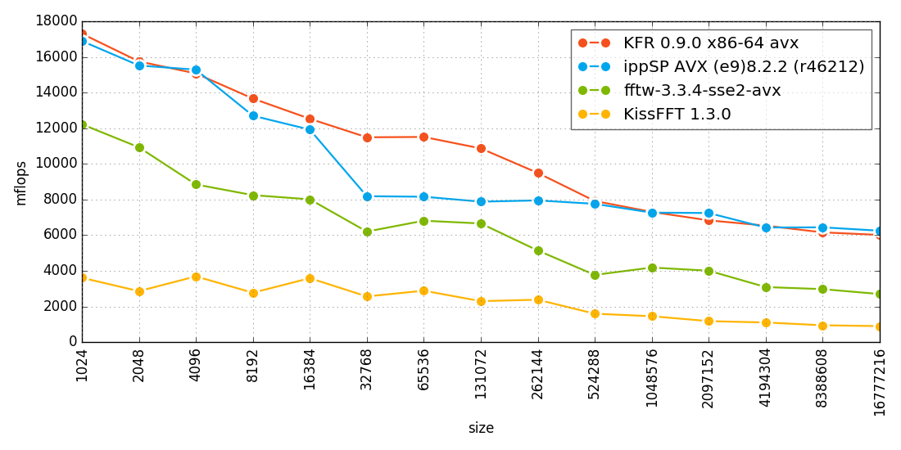

# KFR - Fast, modern C++ DSP framework

https://www.kfrlib.com

## Benchmark results
### FFT

FFT (double precision, sizes from 1024 to 16777216)
See [fft benchmark](https://github.com/kfrlib/fft-benchmark) for details about benchmarking process.

    
## Prerequisites

* macOS: XCode 6.3, 6.4, 7.x, 8.x
* Windows
  * MinGW 5.2 and Clang 3.7 or newer (MinGW 4.8 is also supported, but MinGW 5.x is recommended)
  * Visual Studio 2015 update 2 and latest Clang 3.9.0
* Ubuntu: GCC 5.1 and Clang 3.7 or newer
* CoMeta metaprogramming library (already included)

## License

KFR is dual-licensed, available under both commercial and open-source GPL license.

If you want to use KFR in commercial product or a closed-source project, you need to [purchase a Commercial License](https://kfrlib.com/purchase-license)
